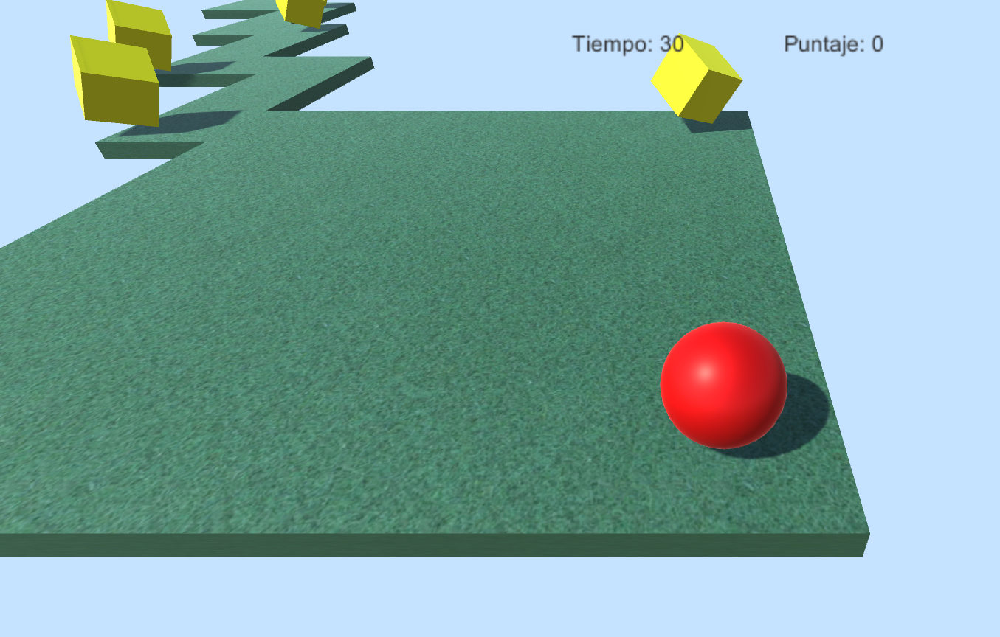

  

you must reach the goal and collecting as many coins as possible
avoiding to falling down. Take care, the time runs out!

You can configure:

- Player’s force, this affects the movement’s speed. This force will
increase each time that the player collects a coin.
- Maximum time of the game, when it reaches 0, the game is over.
- You can add more coins as simple as dragging in the scene the prefab
called “Coin”, or remove it from the scene.